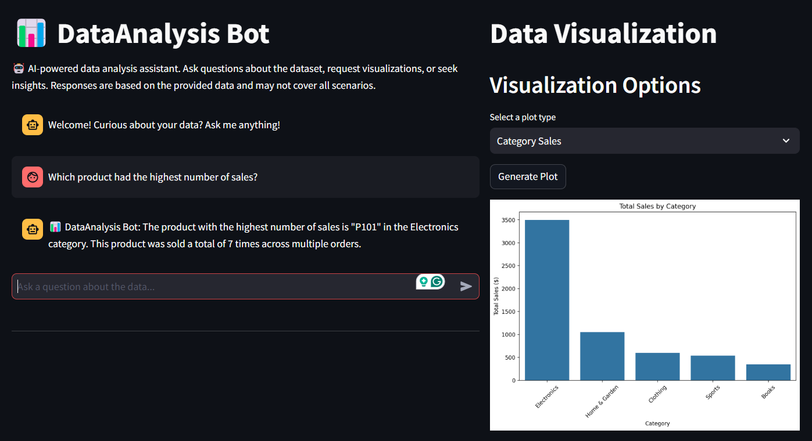
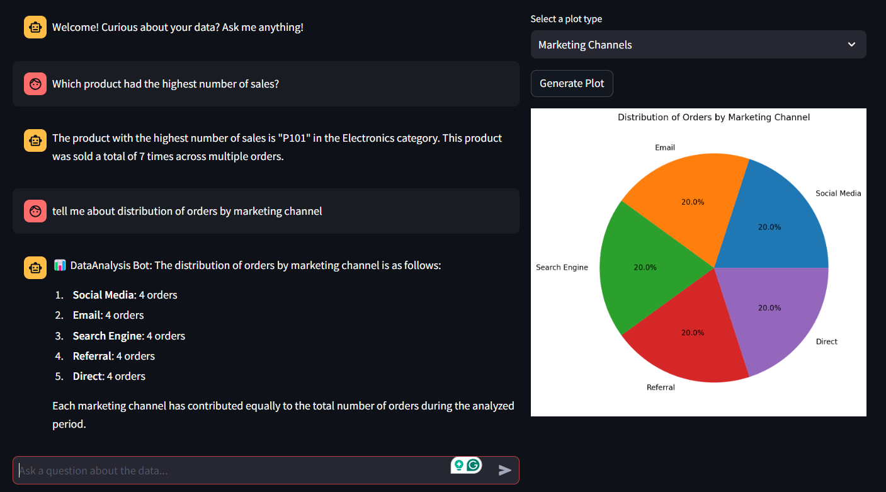
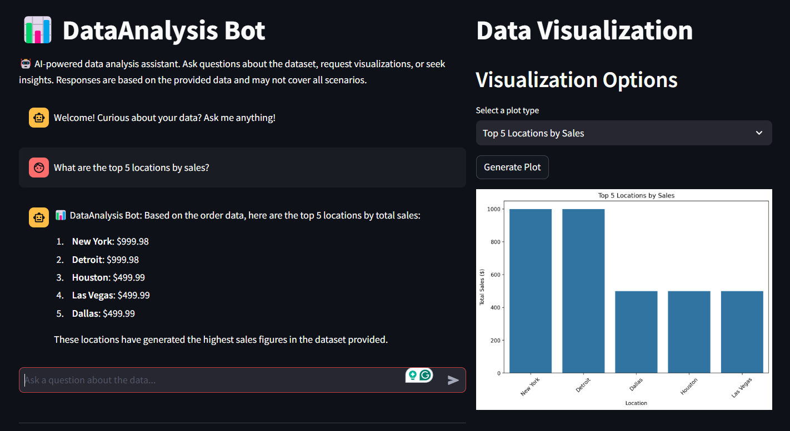
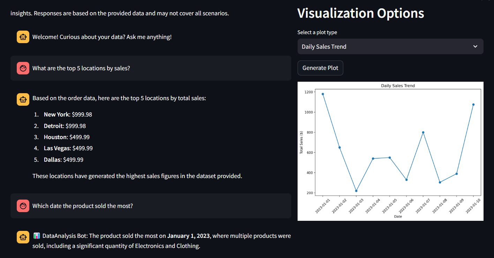

# LLM-DataAnalyst-Bot: AI-Powered Data Analysis Assistant

## Overview

LLM-DataAnalyst-Bot is an AI-powered assistant designed to provide insights and visualizations from datasets. This chatbot leverages advanced language models and data analysis techniques to offer accurate and context-aware responses based on the provided data.

## About LLM-DataAnalyst-Bot

LLM-DataAnalyst-Bot is an interactive tool that combines the power of AI with data visualization capabilities. It allows users to explore datasets, generate insightful visualizations, and get answers to complex data-related questions. The bot can analyze trends, provide statistical summaries, and offer data-driven recommendations, making it an invaluable tool for data analysts, researchers, and decision-makers.

Currently, LLM-DataAnalyst-Bot reads data from the 'documents' folder, processes queries about this data, and generates relevant plots and visualizations based on user requests.

## Dataset Information

The bot currently uses the `order_details.csv` file located in the 'documents' folder. This dataset contains information about product orders, including details such as customer location, age, product categories, and sales figures.

## 🚀 Try the App

You can test the live app here: [LLM-DataAnalyst-Bot AI Assistant](https://llm-dataanalyst-bot-hqvahj7kqbilh7mf68n7mg.streamlit.app/)

## Sample Queries

Here are some example questions you can ask LLM-DataAnalyst-Bot:

| | |
|:-------------------------:|:-------------------------:|
|  Product Sales Category |   Marketing Channels|
| Top Sales Location |   Daily Sales Trend|

## Features

- Provides detailed analysis on:
  - Sales trends and forecasts
  - Customer segmentation and behavior
  - Product performance and inventory management
  - Geographic distribution of sales
  - Marketing channel effectiveness
  - Seasonal patterns and anomalies
- User-friendly chat interface
- Context-aware responses
- Data visualization capabilities
- Based on the latest available dataset

## Technology Stack

LLM-DataAnalyst-Bot is built using a modern tech stack designed for efficient data analysis and natural language processing:

- Backend:
  - Python
  - LangChain for LLM integration and agents
  - OpenAI GPT-4o for natural language understanding and generation
- Data Analysis and Visualization:
  - Pandas for data manipulation
  - Matplotlib and Seaborn for creating visualizations
- User Interface:
  - Streamlit for creating the web-based chat interface
- Data Storage:
  - CSV files for storing the dataset

This combination allows for accurate, context-aware responses while providing powerful data analysis and visualization capabilities.

## Usage

To run the LLM-DataAnalyst-Bot:
   ```
   streamlit run app.py
   ```

## Happy Data Analysis!
